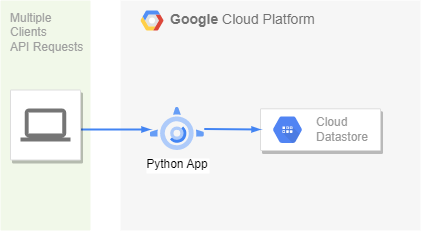

<!--Category:C#,SQL--> 
 <p align="right">
    <a href="http://productivitytools.tech/productivitytools-createsqlserverdatabase/"><a> 
    <a href="https://www.github.com/pwujczyk/ProductivityTools.CreateSQLServerDatabase"></a>
</p>
<p align="center">
    <a href="http://http://productivitytools.tech/">
        
    </a>
</p>


# ProductivityTools.Learning.GCPAppEngineExample

[Tutorial](https://cloud.google.com/appengine/docs/standard/python3/building-app)

Create virtual environment
```
python -m venv env
.\env\Scripts\activate
```

Install requirements
```
pip install -r requirements.txt
```

Run the application (http://localhost:8080/)
```
pythom main.py
```


deploy code
```
gcloud app deploy
```
